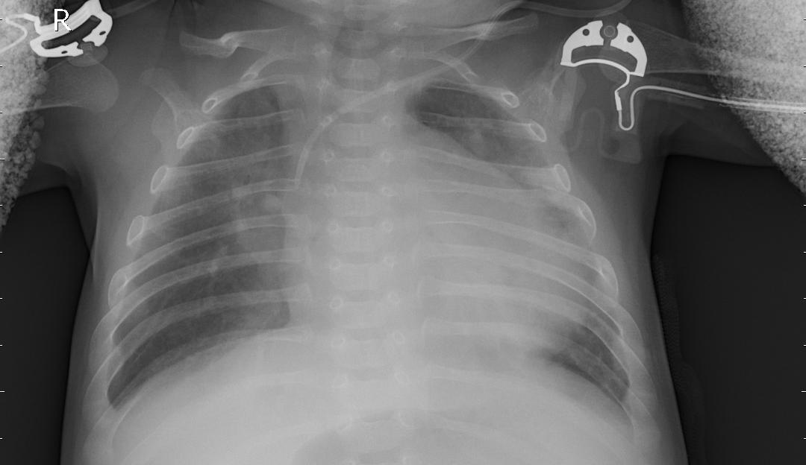

# Pneumonia Detection via CNN for Kaggle Dataset
---------------------------

## CNN for the Detection of Pneumonia 
> Pneumonia is an infection that inflames the air sacs in one or both lungs. The air sacs may fill with fluid or pus (purulent material), causing cough with phlegm or pus, fever, chills, and difficulty breathing. A variety of organisms, including bacteria, viruses and fungi, can cause pneumonia. [[Mayo Clinic](https://www.mayoclinic.org/diseases-conditions/pneumonia/symptoms-causes/syc-20354204)]

A simple CNN detects Pneumonia from X-rays with an Accuracy of 87%.
Keras with VGG16 and Dropout is used.

## Dataset
* Site: https://www.kaggle.com/paultimothymooney/chest-xray-pneumonia
* Data: https://data.mendeley.com/datasets/rscbjbr9sj/2
* License: CC BY 4.0
* Citation: http://www.cell.com/cell/fulltext/S0092-8674(18)30154-5
